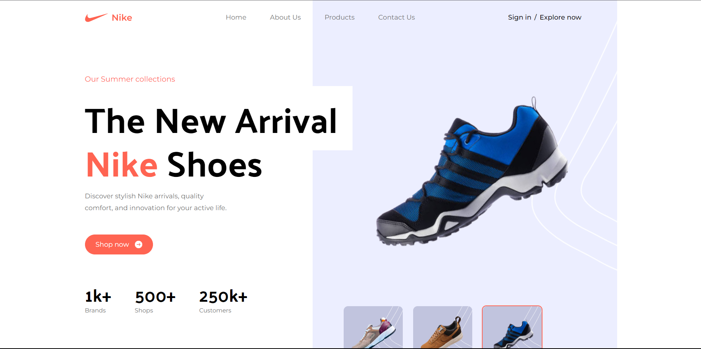

<p align="center">
  
</p>

<h1 align="center">🚀 My Super Cool Website 🚀</h1>

<p align="center">
  A stunning website showcasing my HTML, CSS, JavaScript, Tailwind CSS, and React skills with a touch of creativity.
</p>

<p align="center" style="font-size: 24px; color: #333; margin-top: 20px; font-family: 'Arial', sans-serif;">
🎨 Elegant Design | 📱 Mobile-Friendly | ✨ Seamless Animations
</p>

<p align="center">
  
  
  
  
  <a href="https://reactjs.org/" target="_blank" rel="noreferrer">
    
  </a>
    
</p>


## 🚀 Get Started

### Installation

1. Clone the repository to your local machine:

   ```shell
   git clone https://github.com/ABDULLAHRH1/React-Tailwind-Nike.git
